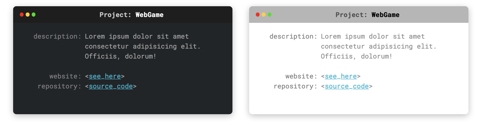

# Project Card

## Link 

[See on GH Pages](https://dawid93.github.io/ProjectCard/)

## Description

Cards for describe project stylized as terminal window. Cards are created in HTML and SCSS. In project you can find two themes for cards `Dark` (daefault) and `Light`.

## How to run:
`npm install -g gulp-cli`

`npm install`

`gulp`
