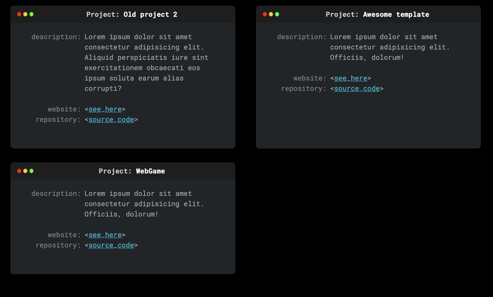

# Project Card

Simple project created in HTML and SASS with cards stylized as Mac OS terminal window. Cards was create for describe projects for example on portfolio page.

## How to run:
`npm install -g gulp-cli`

`npm install`

`gulp`
